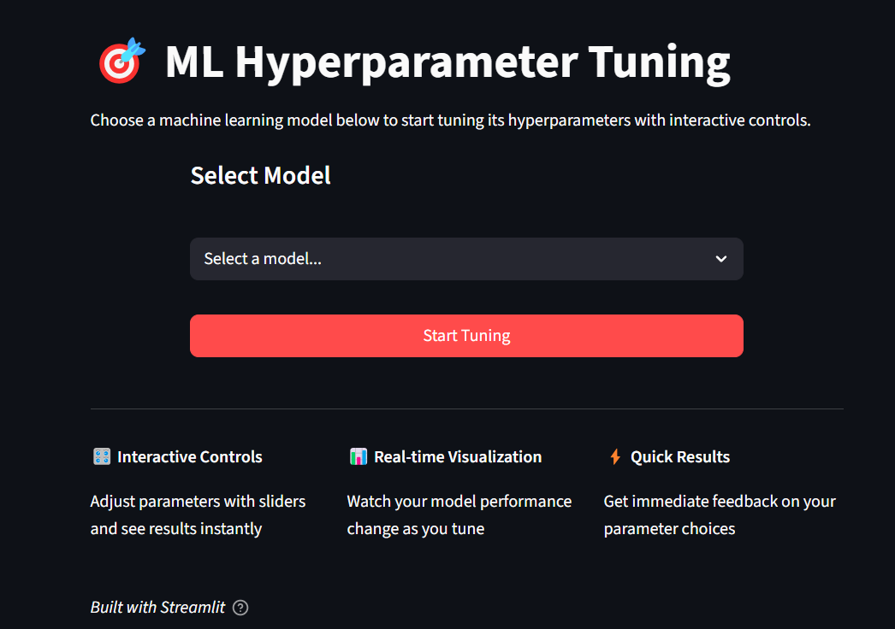
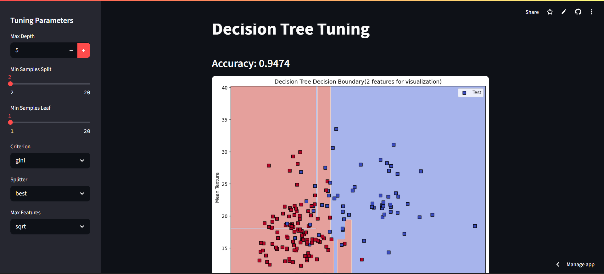

# 🎛️ ML Hyperparameter Tuning Playground

This project is a collection of **interactive Streamlit app** that let you **tune hyperparameters** of various classical machine learning models in real-time.


Each app focuses on:
- 🎯 Tuning model hyperparameters
- 🧪 Evaluating model performance
- 📈 Visualizing results (PCA, accuracy, confusion matrix, etc.)

---
<br>
## 🚀 Run Any Model App

### 1. Clone the repository:
```bash
git clone https://github.com/hetbhalani/HyperTuna.git
```

### 2. Install dependencies:
```
pip install -r requirements.txt
```

### 3. Run the App:
```
streamlit run app.py
```

<br>

## 📷 Screenshorts

<p align="center">
  
  
</p>

<br>

## 🧠 Included Models

| Filename           | Model                  | Type           | Visuals / Outputs               |
|--------------------|------------------------|----------------|---------------------------------|
| `knn.py`           | K-Nearest Neighbors    | Classification | Accuracy, Confusion Matrix, PCA |
| `decision_tree.py` | Decision Tree          | Classification | Accuracy, Tree Depth, Heatmap   |
| `random_forest.py` | Random Forest          | Classification | Accuracy, Feature Importance    |
| `xgboost.py`       | XGBoost                | Classification | Accuracy, Feature Importance    |
| `svm.py`           | Support Vector Machine | Classification | Accuracy, Heatmap               |
| `k_means.py`       | KMeans Clustering      | Clustering     | PCA Plot, Cluster Accuracy      |
| `dbscan.py`        | DBSCAN Clustering      | Clustering     | PCA Visualization               |

<br>

## ✨ Features
🔧 Interactive Hyperparameter Tuning via sliders and dropdowns

📊 Live metrics: Accuracy, R² Score, Confusion Matrix, Cluster Performance

📉 Visualizations: PCA, Feature Importance, Heatmaps

🎓 Educational: Learn how tuning affects model performance

<br>

## 👨‍💻 Author
Built by Het Bhalani — feel free to connect or contribute!<br>
inspired by - CampusX

<br>

## 🤝 Contribute

Feel free to **fork** this repository, **improve** the code, and make a **Pull Request** — your contributions are highly appreciated! 🚀

### 🔧 Here are some functionalities you can add:
- Add more ML models
- User can add csv file and based in that user can tune selected model
- Implement cross-validation for better evaluation
- Add export functionality for trained models (e.g., using `joblib`)
- Improve visualizations with more interactive plots (e.g., Plotly)

Let’s make this project better together! 💡
